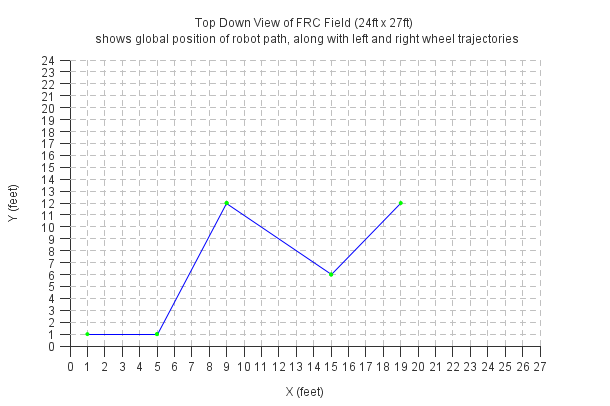
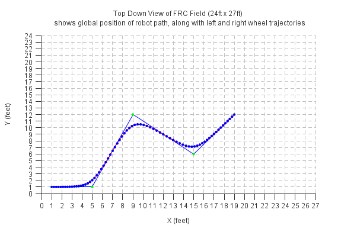
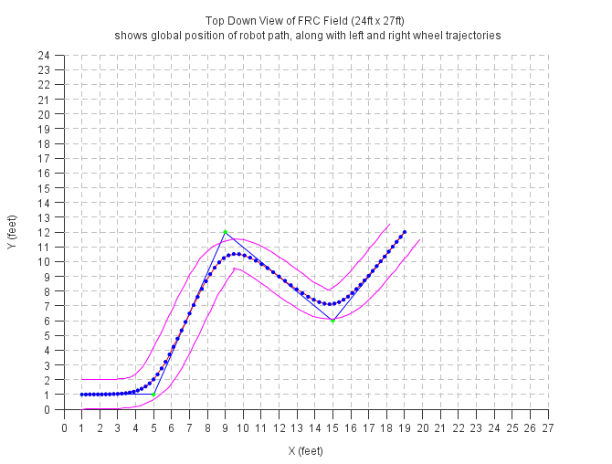
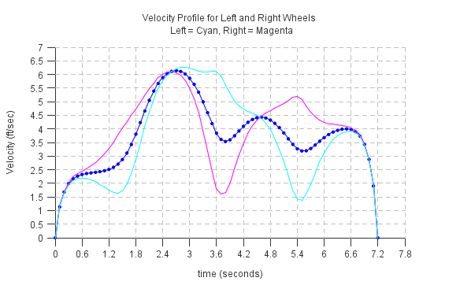
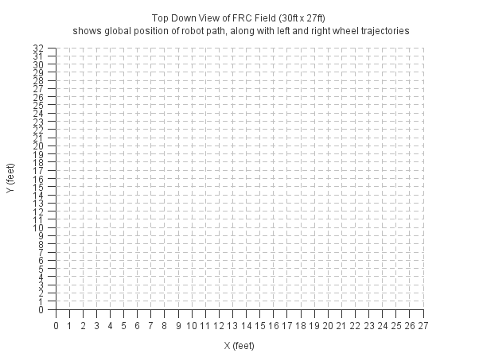
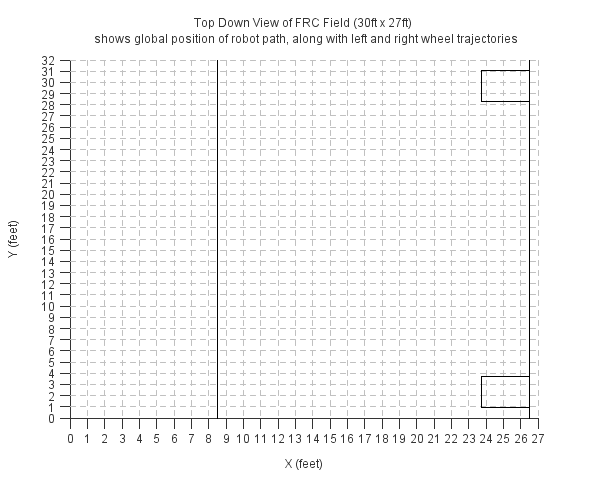
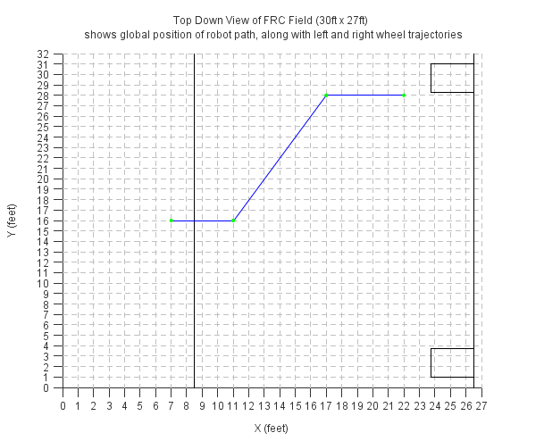
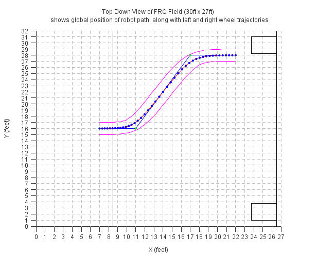
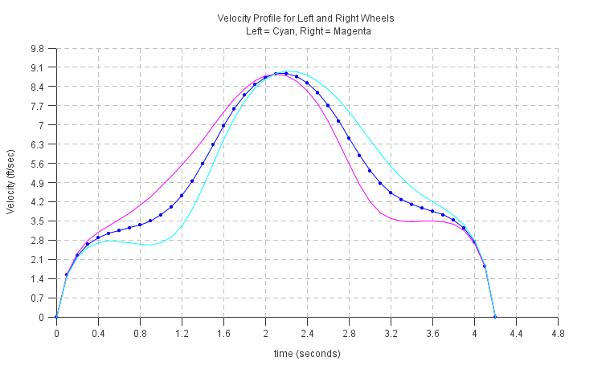

SmoothPathPlanner
=================


After the Cheesy Poofs (FRC 254) put on an amazing display of robot path following during the 2014 FRC championship finals, a lot of buzz has been generated by other teams wishing to implement a similar feature on their robot. The poofs released their code and the community learned they used 5th order polynomial splines in order to find the best fit smooth curve from POint A to Point B.

Path planning has been the primary focus in many other fields outside of FRC. For example in Game AI, generating smooths paths for the main character to follow when going around obstacles needs to be calculated in real-time. In other robotics fields such as autonomous car navigation, many smooth paths need to be generated simultaneously, and the "best" path choosen.

These fields have spent many years adopting and optimizing the field of motion planning for their specific application. However, what they have in common is that the calculations for generating the path needs to be performed in real-time, and typically are performed on inexpensive embedded devices, such as gaming consoles or car computers. As part of my PhD thesis (developing a controller for an Autonomous Car) I had the opportunity to create a simplified path planner for real-time mobile robot applications.

This class is a port of the code I developed for my PhD thesis, to perform the function of path calculation on a mobile, skid-steer robot very quickly. The algorithms provided here rely on algorithms used in optimal control theory to converge to a solution very quickly. The code here uses the "gradient descent" optimization technique to coerce a simple waypoint path, into a smooth trajectory. 

Once the smooth trajectory is determined, parallel paths for the left and right wheels are calculated based on the robots trackwidth distance, and corresponding velocities for each of the wheels are determined. As long as the robot has independant speed controllers for the left and right side of the drivetrain, the user can "play" through the velocity profile as if they are setpoints and the robot should drive the corresponding path.

The function takes in just 3 paramters to get started and boost a very simple user interface.

1. `TotalTime` - is the time you wish the robot to complete the path, this is used to calculate the velocity
2. `Time Step` - this is the rate at which the controller on your robot runs. Typically for FRC we run our controllers at a 100ms rate in a separate thread from the main Robot.
3. `TrackWidth` - the distance between the left and right wheels of the robot. This is used to calculate the left and right wheel paths.
	
The waypoints are simply global positions you would like your robot to drive, specified as a 2D array. The order of the points specify the path which the user wishes to drive, and the smooth path is generated accordingly. The smooth path generated also uses the Max Time, and controller periodic rate to automatically create the proper length velocity array so the user simply steps through each element once every time step. The end result is that the robot drives along the path, depending how well your speed controllers are tuned. So for example, if you have a controller running at 100ms, and you want a path that will take no more than 5 seconds to travsers, the algorithm will provide the left and right velocities as arrays with no more than 5/0.1 = 50 points. Each point will contain the velocity the robot should be at the time to make the end position by the end of travel.

Here is an an example to generate a path using the default paramters. 

```java
//create waypoint path
double[][] waypoints = new double[][]{
	{1, 1},
	{5, 1},
	{9, 12},
	{12, 9},
	{15, 6},
	{19, 12}
}; 

double totalTime = 8; //max seconds we want to drive the path
double timeStep = 0.1; //period of control loop on Rio, seconds
double robotTrackWidth = 2; //distance between left and right wheels, feet

FalconPathPlanner path = new FalconPathPlanner(waypoints);
path.calculate(totalTime, timeStep, robotTrackWidth);
```

After the `calculate` method is called, the smooth path and left and right velocities are all calculated and stored into the class data members. Below is the list of each class path variable. Note, all of the data members of this class are public. While this is usually not a good idea, I think for this case, and how we use these classes in FRC, it makes sense to leave these as public so the user can access them and modify them as needed. Note `path` is the class instantiated from the example above.

```Java
path.origPath; // 2D array of doubles which contains the original waypoint path provided
path.nodeOnlyPath; // 2D array of doubles which filters the original path and only keeps points which
		   //cause the path to change direction (i.e. all intermediate points on a straight line
		   //are removed)
path.smoothPath; //2D array of doubles represents the smooth path for the center of the robot.
path.leftPath; //2D array of doubles represents the left wheel path (based on track width of robot) 
path.rightPath; //2D array of doubles represents the right wheel path (based on track width of robot)
	
path.smoothCenterVelocity; //2D array of doubles which contains a smooth velocity profile of the smoothPath above
path.smoothRightVelocity; //2D array of doubles which contains a smooth velocity profile of the rightPath above
path.smoothLeftVelocity; //2D array of doubles which contains a smooth velocity profile of the leftPath above
```

At this point all you need to do is pass `path.smoothRightVelocity` and `path.smoothLeftVelocity` to the Robots left and right wheel speed controllers. "Play" through the array updating the setpoint of the controller with the next element of the array each time step.

>Note: ALL PATH 2 DIMENSIONAL ARRAYS CONTAIN THE X-COORDINATE IN THE FIRST DIMENSION, AND THE Y COODINATE IN THE SECOND DIMENSION. SO `path.rightPath[i][0]` would be the ith X- coodinate, and `path.rightPath[i][1]` would be the ith Y- coordinate of the right wheel path for example. THE UNITS OF THESE ARE THE GLOBAL UNITS ASSUMED BY THE USER.

>Note: ALL VELOCITY 2 DIMENSIONAL ARRAYS CONTAIN THE TIME VECOTOR IN THE FIRST DIMENSION, AND THE VELOCITY MAGNITUDE IN THE SECOND DIMENSION. So `path.smoothLeftVelocity[i][0]` would be the ith time step value in seconds, and `path.smoothLeftVelocity[i][1]` would be the ith velocity magnitude in units per second. **When attemping to command the speed controller, the user only needs to pass the `path.smoothLeftVelocity[i][1] array, which is a single dimension array of doubles to the speed controller.** 

Furthermore, the algorithm also implements a smooth start/stop routine and automatically ramps up and down to a zero velocity so at the end of travel the robot slows down to zero. The coerceion to zero velocity takes in to account the total distance needed to travel and modifies the velocity accordingly. 

Typically when I write complex algorithms, I tend to put the Big O notation in the JavaDoc comments of each method and I also write down a pseudocode to help guide me as I program the algorithm. Typically I remove these comments in the final product, but I decided to leave them in to help people follow my logic, and see which Algorithms I have optimized, and which algorithms could use more optimization. Most algorithms have been optimized to linear Big O notation.

I have tested this algorithm on a 2015 RoboRio and for a path containing  

<Include timing assessment>

## Using the Included Grapher

I have also included a very crude graphing class to help visualize the output. The graphing class is also written using native Java SE classes and will run on any desktop. 

>Note: Because the RoboRio is headless (meaning no display), the Graph functions can not run on the RoboRio.  Check `if(!GraphicsEnvironment.isHeadless())` before graphing this way the code is completely portable and will run on both desktop and RoboRio.

So let’s work through an example of how to use this class:

If we want to graph the output of the path above we can do the following and produce the following plot:
```Java
FalconLinePlot fig1 = new FalconLinePlot(path.nodeOnlyPath,Color.blue,Color.green);
```


The plot above isn’t that helpful. However we can configure it to be more useful to us. Since this is the plot of the global path of the robot. Let’s change the X- and Y- axis to reflect the dimensions of half of the FRC field (24 x 27ft) and lets add some labels and grid lines. 

```Java
fig1.yGridOn();
fig1.xGridOn();
fig1.setYLabel("Y (feet)");
fig1.setXLabel("X (feet)");
fig1.setTitle("Top Down View of FRC Field (24ft x 27ft) \n shows global position of robot path, along with left and right wheel trajectories");

//force graph to show 1/2 field dimensions of 24ft x 27 feet
fig1.setXTic(0, 27, 1);
fig1.setYTic(0, 24, 1);
```


The above figure is more useful. It shows the general path we wish the robot to take. Starting at our waypoint {1,1} and ending at {19,12}. This plot is in feet. The real usefulness of the plotter function is the ability to add additional plots to one figure. You can add an unlimited amount of charts using the `addData` method. There are also options to specify line color, and marker color. If you do not wish to have lines or markers, set them to `null`.

Lets add the smooth center path the algorithm calculated to this plot. Which gives the following:
```Java
fig1.addData(path.smoothPath, Color.red, Color.blue);
```

We can see the smooth path algorithm does two things. It creates many more data points and provides smooth transitions around the corners.  The number of data points created is based on the max Time you wish the robot to complete the path, and the time step of the controller. 

We can also add the left and right path trajectories to the plot to provide all the useful information we need in one chart. 

```Java
fig1.addData(path.leftPath, Color.magenta);
fig1.addData(path.rightPath, Color.magenta);
```



I choose this example for a reason, and we can see some tight turns on the robot in the example. (Maybe too tight) We will fix those later (todo: see section here), but first let’s see what the velocity looks like for this path. 

```Java
FalconLinePlot fig2 = new FalconLinePlot(path.smoothCenterVelocity,null,Color.blue);
fig2.yGridOn();
fig2.xGridOn();
fig2.setYLabel("Velocity (ft/sec)");
fig2.setXLabel("time (seconds)");
fig2.setTitle("Velocity Profile for Left and Right Wheels \n Left = Cyan, Right = Magenta");
fig2.addData(path.smoothRightVelocity, Color.magenta);
fig2.addData(path.smoothLeftVelocity, Color.cyan);
```



This is where you need to determine, if the velocities shown can be accomplished by your robot. Looks like the max and min velocity is achievable for most drivetrains so let’s continue. We also note there is a relatively smooth transition between data points. If your velocity isn’t smooth, modify the way points so that it is smooth. The robot will not react well to instant changes in velocity.  Note the total time is 7.2 seconds which is less than the `8` second requirement we provided. If we increase or decrease the time requirement, the magnitude of the velocity will decrease or increase, respectively.

## Let’s recreate the Cheezy Poof Path
As another example we are going to try and replicate the smooth path used by FRC Team 254 during the 2014 FRC Einstein Finals, Match 3.

```Java
//Lets create a bank image
FalconLinePlot fig3 = new FalconLinePlot(new double[][]{{0.0,0.0}});
fig3.yGridOn();
fig3.xGridOn();
fig3.setYLabel("Y (feet)");
fig3.setXLabel("X (feet)");
fig3.setTitle("Top Down View of FRC Field (28ft x 27ft) \n shows global position of robot path, along with left and right wheel trajectories");

//force graph to show 1/2 field dimensions of 24.8ft x 27 feet
double fieldWidth = 32.0;
fig3.setXTic(0, 27, 1);
fig3.setYTic(0, fieldWidth, 1);
```  




We can add the Goal wall, and low goals to the view.

```Java
//lets add field markers to help visual
//http://www.usfirst.org/sites/default/files/uploadedFiles/Robotics_Programs/FRC/Game_and_Season__Info/2014/fe-00037_RevB.pdf
//Goal line
double[][] goalLine = new double[][] {{26.5,0}, {26.5, fieldWidth}};
fig3.addData(goalLine, Color.black);
			
//Low Goals roughly 33 inch x 33 inch and 24.6 ft apart (inside to inside)
double[][] leftLowGoal = new double[][]{
{26.5, fieldWidth/2 + 24.6/2},
{26.5, (fieldWidth)/2 + 24.6/2 + 2.75},
{26.5 - 2.75, fieldWidth/2 + 24.6/2 + 2.75},
{26.5 - 2.75, fieldWidth/2 + 24.6/2},
{26.5, fieldWidth/2 + 24.6/2},
};
			
double[][] rightLowGoal = new double[][]{
{26.5, fieldWidth/2 - 24.6/2},
{26.5, fieldWidth/2 - 24.6/2 - 2.75},
{26.5 - 2.75, fieldWidth/2 - 24.6/2 - 2.75},
{26.5 - 2.75, fieldWidth/2 - 24.6/2},
{26.5, fieldWidth/2 - 24.6/2},
};
			
fig3.addData(leftLowGoal, Color.black);
fig3.addData(rightLowGoal, Color.black);

//Auto Line
double[][] autoLine = new double[][] {{26.5-18,0}, {26.5-18, fieldWidth}};
fig3.addData(autoLine, Color.black);
```


Using the above plot, we can create the following waypoint trajectory to replicate the path taken by FRC 254 on Einstein Final Match 3;

```Java
		double[][] CheesyPath = new double[][]{
			{7,16},
			{11,16},
			{17,28},
			{22,28},
	};
		
		double totalTime = 4.5; //seconds
		double timeStep = 0.1; //period of control loop on Rio, seconds
		double robotTrackWidth = 2; //distance between left and right wheels, feet

		final FalconPathPlanner path = new FalconPathPlanner(CheesyPath);
		path.calculate(totalTime, timeStep, robotTrackWidth);
		
		fig3.addData(path.nodeOnlyPath,Color.blue,Color.green);
```



Adding all of the other path parameters as well:

```Java
		//add all other paths
		fig3.addData(path.smoothPath, Color.red, Color.blue);
		fig3.addData(path.leftPath, Color.magenta);
		fig3.addData(path.rightPath, Color.magenta);
```



We also plot the Velocity of this chart:
```Java
		//Velocity
		FalconLinePlot fig4 = new FalconLinePlot(path.smoothCenterVelocity,null,Color.blue);
		fig4.yGridOn();
		fig4.xGridOn();
		fig4.setYLabel("Velocity (ft/sec)");
		fig4.setXLabel("time (seconds)");
		fig4.setTitle("Velocity Profile for Left and Right Wheels \n Left = Cyan, Right = Magenta");
		fig4.addData(path.smoothRightVelocity, Color.magenta);
		fig4.addData(path.smoothLeftVelocity, Color.cyan);
```




This is actually a really nice velocity curve. The transactions are very smooth for each wheel. Assuming our robot can meet these velocities we will traverse the smooth path in 4.2 seconds and stop! You will notice the left wheel slows down first to allow for the slight left turn in the beginning, and then the right wheel slows down to allow for the slight right turn.

At this point, all we need to do is pass `path.smoothLeftVelocity[i][1]` and ``path.smoothRightVelocity[i][1]` to our robot Left and right wheel speed controllers, and update the setpoint to the next value in the array each robot loop iteration. The robot will “play” through the array and drive the smooth path. 

The complete code for this example is below:

```Java
		/***Poof Example***/

		//Lets create a bank image
		FalconLinePlot fig3 = new FalconLinePlot(new double[][]{{0.0,0.0}});
		fig3.yGridOn();
		fig3.xGridOn();
		fig3.setYLabel("Y (feet)");
		fig3.setXLabel("X (feet)");
		fig3.setTitle("Top Down View of FRC Field (30ft x 27ft) \n shows global position of robot path, along with left and right wheel trajectories");


		//force graph to show 1/2 field dimensions of 24.8ft x 27 feet
		double fieldWidth = 32.0;
		fig3.setXTic(0, 27, 1);
		fig3.setYTic(0, fieldWidth, 1);


		//lets add field markers to help visual
		//http://www.usfirst.org/sites/default/files/uploadedFiles/Robotics_Programs/FRC/Game_and_Season__Info/2014/fe-00037_RevB.pdf
		//Goal line
		double[][] goalLine = new double[][] {{26.5,0}, {26.5, fieldWidth}};
		fig3.addData(goalLine, Color.black);

		//Low Goals roughly 33 inch x 33 inch and 24.6 ft apart (inside to inside)
		double[][] leftLowGoal = new double[][]{
				{26.5, fieldWidth/2 + 24.6/2},
				{26.5, (fieldWidth)/2 + 24.6/2 + 2.75},
				{26.5 - 2.75, fieldWidth/2 + 24.6/2 + 2.75},
				{26.5 - 2.75, fieldWidth/2 + 24.6/2},
				{26.5, fieldWidth/2 + 24.6/2},
		};

		double[][] rightLowGoal = new double[][]{
				{26.5, fieldWidth/2 - 24.6/2},
				{26.5, fieldWidth/2 - 24.6/2 - 2.75},
				{26.5 - 2.75, fieldWidth/2 - 24.6/2 - 2.75},
				{26.5 - 2.75, fieldWidth/2 - 24.6/2},
				{26.5, fieldWidth/2 - 24.6/2},
		};

		fig3.addData(leftLowGoal, Color.black);
		fig3.addData(rightLowGoal, Color.black);

		//Auto Line
		double[][] autoLine = new double[][] {{26.5-18,0}, {26.5-18, fieldWidth}};
		fig3.addData(autoLine, Color.black);


		double[][] CheesyPath = new double[][]{
				{7,16},
				{11,16},
				{17,28},
				{22,28},
		};

		double totalTime = 4.5; //seconds
		double timeStep = 0.1; //period of control loop on Rio, seconds
		double robotTrackWidth = 2; //distance between left and right wheels, feet

		final FalconPathPlanner path = new FalconPathPlanner(CheesyPath);
		path.calculate(totalTime, timeStep, robotTrackWidth);

		//waypoint path
		fig3.addData(path.nodeOnlyPath,Color.blue,Color.green);

		//add all other paths
		fig3.addData(path.smoothPath, Color.red, Color.blue);
		fig3.addData(path.leftPath, Color.magenta);
		fig3.addData(path.rightPath, Color.magenta);


		//Velocity
		FalconLinePlot fig4 = new FalconLinePlot(path.smoothCenterVelocity,null,Color.blue);
		fig4.yGridOn();
		fig4.xGridOn();
		fig4.setYLabel("Velocity (ft/sec)");
		fig4.setXLabel("time (seconds)");
		fig4.setTitle("Velocity Profile for Left and Right Wheels \n Left = Cyan, Right = Magenta");
		fig4.addData(path.smoothRightVelocity, Color.magenta);
		fig4.addData(path.smoothLeftVelocity, Color.cyan);

	}
```


Modifying the calculation paramters
=================
The "smoothness" of the path is controlled by two paramters: Alpha and Beta. These variables take on default values which I believe will work in most cases and do not need to be modified. However, this section covers how to modify these paramters so that you can generate the exact path you wish to traverse.

You can change these paramters individually by calling the setter methods. 

```Java
path.setPathAlpha(0.5);
path.setPathBeta(0.9);
```

After doing-so you will need to call the recalculate menthod to re-calculate the paths using the new paramters
```Java
path.calculate(totalTime, timeStep, robotTrackWidth);
```

Alpha controls how close to the original line we wish the smooth points to be. Beta controls how curvy we wish our path be. The closer Alpha is to 1, the closer the smooth path will be to the original line, the closer Beta is to 1, the larger the path radii should be. Note, these are conflicting requirements, and thus why it is an optimization algorithm. You can think of it this way, as Alpha increases it wants to push the points toward the original path, as beta increses it want to push the points away from the original line and there is a constant tug of war between them. The algorithm converges when both are happy with where the points get pushed. 

Alpha and Beta should be a decimal between 0 and 1. If Alpha is zero regarless of Beta, the output will be a straight line from the starting waypoint to the ending waypoint. 

TODO: add image of different params

Caution: Depending on the combination of the variables, it is very possible to set the parameters such that the algorithm never convergers! So be careful. In general I have found the following settings to be acceptable for converging. However, they are not guranteed and you should test many datasets to be sure, the algorithm will convege to a solution in all your scenarios. If you decide to change the paramters from their defaults. 

If the algorithm does not converge, the program will simply never finish, so it is pretty easy to identify. 

In genral if you must change the parameters Set Beta between 0.1 and 0.4 (Do not set to zero), and set Alpha between 0 and 1 to get desired path output, but here is a complete list of recommended paramters.

| Alpha                | Beta           | 
| -------------        |-------------:  | 
| Any val from 0 to 1     | 0.0            | 
| Any val from 0 to 1     | 0.1            | 
| Any val from 0 to 1     | 0.2            | 
| Any val from 0 to 1     | 0.3            | 
| Any val from 0 to 1     | 0.4            |
| Any val from 0 to 0.9   | 0.5            | 
| Any val from 0 to 0.7     | 0.6            | 
| Any val from 0 to 0.5     | 0.7            |
| Any val from 0 to 0.3     | 0.8            | 
| Any val from 0 to 0.1     | 0.9            | 
| None                      | 1.0            | 


<Example of Paths with different Paramters>

Real-Time Course Correction
============================
The algorithm also provides what the robots heading should be at each time stamp, based on the global coordinate system. The user can use these headings to correct the robots course. As long as the robot maintains the appropriate headings and velocities of each wheels, the robot will drive the course outlined.

The current implementation of the heading is accumulated, not absolute. This is so that users can use the Gyro class already included with WPI lib (which is also accumulated) as a sensor to detect the robots actual heading and course correct.

the heading information is stored in member variable `heading`, so to access it one could call

```java
path.heading[i][0]; //ith time vector for path heading
path.heading[i][1]; //ith point heading in degrees
```

> Note: This algorithm doesn't consider pose of the robot. What that means is it doesn't require an initial or final orientation of the robot, and does not gurantee the final orientation. Once you reach the desintation, you may need to then command your chassis to rotate to the desired final heading.


Assumptions
=========================
1. Robot Chassis is a skid-steer platform
2. Ground robot is to travel on is considered to be an even plane, with no hills, ramps, bumbs, or other obstacles
3. Robot has independant speed controllers for both sides of the Robot Chassis, tuned to meet the velocity profile changes
4. Sufficient time is given for the robot to complete the path. 
